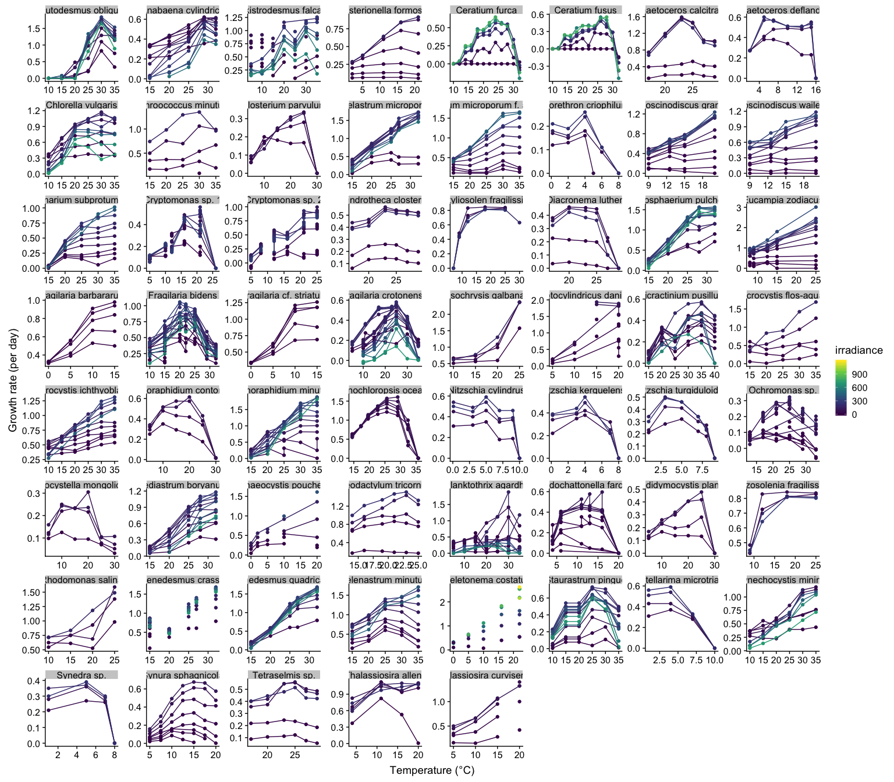
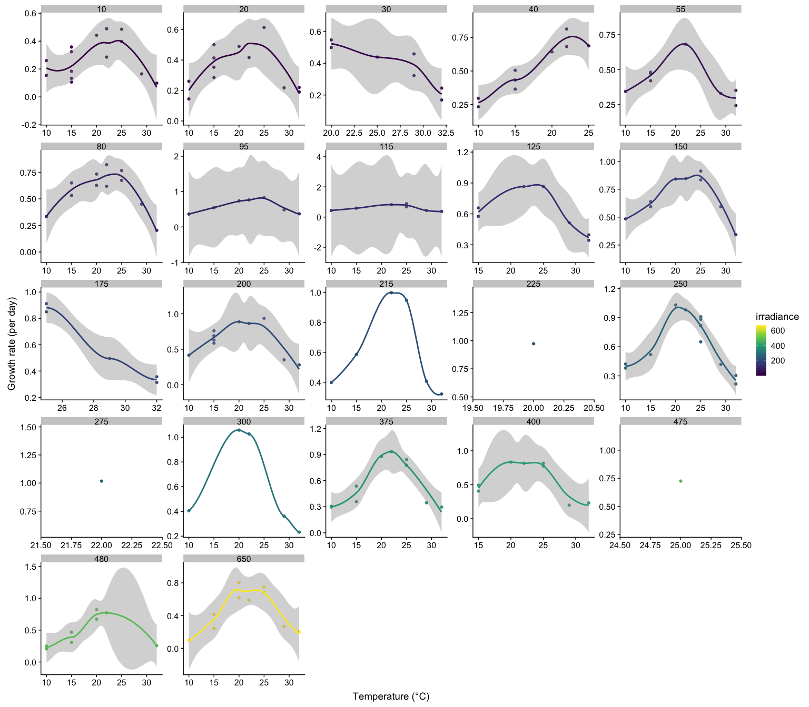
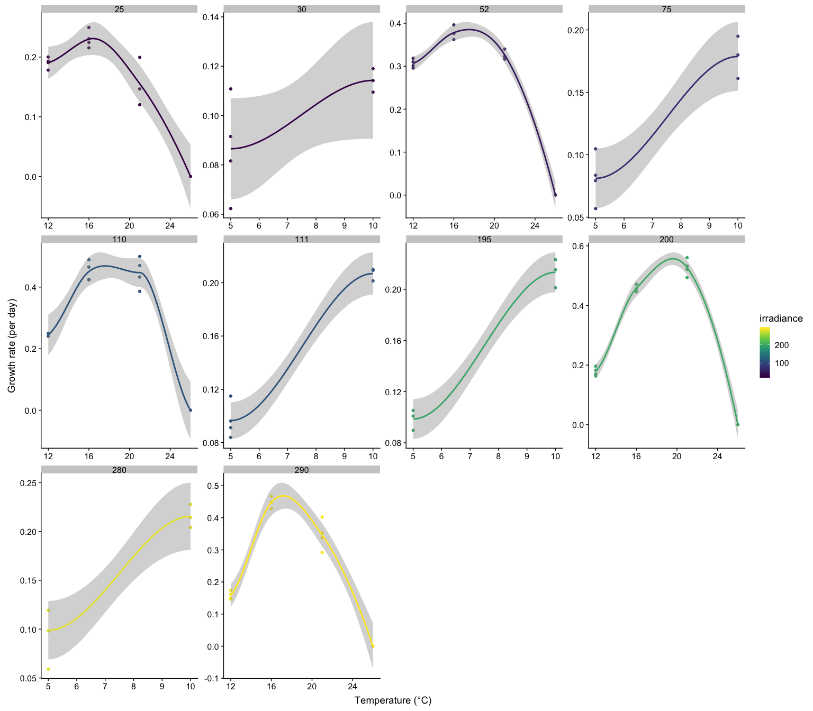
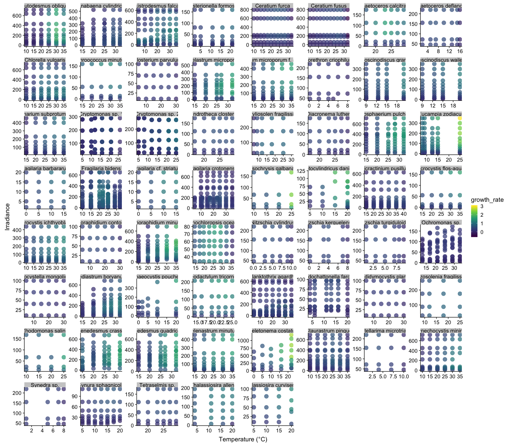

# Edwards-2016-data


Plot data from Edwards et al. 2016 (L&O)

```r
library(tidyverse)
library(readxl)
library(janitor)
library(cowplot)
edwards_raw <- read_xlsx("data-raw/Edwards-2016-tableA3.xlsx", skip = 2) %>% 
	clean_names()
```


Plot all the species in the dataset


```r
edwards_raw %>% 
	ggplot(aes(x = temperature, y = growth_rate, color = irradiance, group = irradiance)) + geom_point() + geom_line() +
	facet_wrap(~ species, scales = "free") + ylab("Growth rate (per day)") + xlab("Temperature (°C)")  + scale_color_viridis_c()
```

<!-- -->

```r
# ggsave("figures/edwards-temp-irradiance.pdf", width = 16, height = 14)
```


Find out how many species have multiple entries per temperature and irradiance; looks like there are only a few species that have multiple entries per temp & irradiance

```r
edwards_raw %>% 
	group_by(species, temperature, irradiance) %>% 
	distinct() %>% 
	tally() %>% 
	filter(n> 1) %>% 
	arrange(desc(n)) %>% 
	head() %>% 
	knitr::kable()
```


species              temperature   irradiance    n
------------------  ------------  -----------  ---
Cryptomonas sp. 2             12           57    5
Cryptomonas sp. 2             12          267    5
Fragilaria bidens             15           10    5
Cryptomonas sp. 1              5           30    4
Cryptomonas sp. 1              5           75    4
Cryptomonas sp. 1              5          111    4


Plot TPCs for Fragilaria bidens

```r
edwards_raw %>% 
	filter(species == "Fragilaria bidens") %>% 
	ggplot(aes(x = temperature, y = growth_rate, color = irradiance, group = irradiance)) + geom_point() +
	facet_wrap( ~ irradiance, scales = "free") + geom_smooth(aes(color = irradiance)) +
	ylab("Growth rate (per day)") + xlab("Temperature (°C)")  + scale_color_viridis_c()
```

<!-- -->

```r
# ggsave("figures/fragilaria_tpc.pdf", width = 10, height = 8)
```


Plot TPCs for Cryptomonas sp.1

```r
edwards_raw %>% 
	filter(species == "Cryptomonas sp. 1") %>% 
	ggplot(aes(x = temperature, y = growth_rate, color = irradiance, group = irradiance)) + geom_point() +
	facet_wrap( ~ irradiance, scales = "free") + geom_smooth(aes(color = irradiance)) +
	ylab("Growth rate (per day)") + xlab("Temperature (°C)")  + scale_color_viridis_c()
```

<!-- -->

```r
# ggsave("figures/cryptomonas_tpc.pdf", width = 10, height = 8)
```

Make a heatmap-y type plot

```r
edwards_raw %>% 
	ggplot(aes(x=temperature, y=irradiance, color=growth_rate)) + 
	geom_point(size = 4, alpha = 0.7) + scale_color_viridis_c() +
	facet_wrap( ~ species, scales = "free") +ylab("Irradiance") + xlab("Temperature (°C)")
```

<!-- -->

```r
# ggsave("figures/edwards-temp-irradiance-heatmap.pdf", width = 16, height = 14)
```
